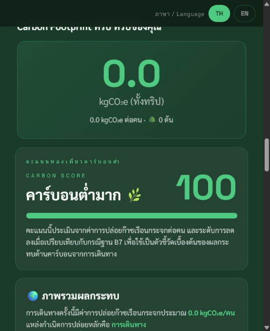

# Carbon Free Journey Calculator

## Project Overview

Carbon Free Journey Calculator is a simple carbon calculator for estimating travel-related emissions and comparing lower-carbon choices.

The project is designed as an awareness and communication tool that helps users understand how travel choices affect carbon emissions.

TH: เครื่องมือนี้ช่วยคำนวณคาร์บอนจากการเดินทางอย่างเข้าใจง่าย เหมาะสำหรับกิจกรรมสื่อสาร ESG / Carbon Awareness และการเริ่มต้นพูดคุยเรื่องลดคาร์บอน

## Business Problem

Carbon Footprint can feel technical and difficult for general users or factory teams who are just starting ESG work. Without a simple example, it can be hard to explain how daily activities connect to emissions and reduction choices.

This calculator makes the concept more tangible by turning travel activity into a simple estimated carbon result.

## Objective

- Provide a simple carbon-awareness calculator.
- Help users compare travel choices and understand basic emission drivers.
- Support sustainability communication and training workshops.
- Demonstrate how carbon calculation concepts can be turned into user-friendly tools.

## Target Users

- General users learning about carbon footprint
- ESG training participants
- Sustainability communication teams
- SME factories starting carbon-awareness activities
- Consultants explaining carbon reduction concepts
- Event or travel-related awareness campaigns

## Key Features

- Trip setup workflow
- Transport emission calculation
- Activity emission calculation
- Low Carbon Score concept
- Emission breakdown
- Scenario comparison
- Carbon offset options
- Thai / English content direction
- Mobile-first single-page experience

## Tech Stack

- HTML
- CSS
- JavaScript
- GitHub Pages
- Browser-based calculation logic

## Use Case for Consulting Work

This project can be used in ESG and carbon-awareness workshops to explain carbon footprint in a friendly way before moving into more formal CFO or CFP calculations.

Example consulting use cases:

- Carbon awareness training
- ESG engagement activity
- Low-carbon travel communication
- Introductory carbon-footprint explanation
- Demonstration of simple calculation logic

## Project Status

Prototype / MVP

The project is suitable for awareness, demonstration, and training use. It is not a formal carbon verification tool and should not be used as an official CFO / CFP calculation system without validated emission factors, scope boundaries, documentation, and review.

## Demo Link

Live Demo: https://thesor55.github.io/Carbon-Free-Journey-Calculator/

## Screenshots

## Future Improvement Plan

- Add clearer emission-factor references.
- Add downloadable result summary.
- Add more transport and activity options.
- Add Thai / English toggle refinements.
- Add scenario comparison for reduction planning.

## Disclaimer

This calculator is for awareness and demonstration. Results are estimates and should not be used as official verified carbon-footprint results.

## Recommended GitHub About Description

Simple travel carbon calculator for awareness, low-carbon choices, and carbon reduction communication.

## Recommended GitHub Topics

`iso` `esg` `carbon-footprint` `cfo` `cfp` `factory-dashboard` `audit-checklist` `sustainability` `smart-factory` `thai-sme` `github-pages`
